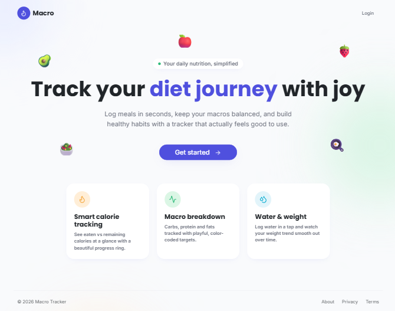

<div align="center">


# Macro

**Applicazione Full Stack per il tracciamento dei tuoi macronutrienti e delle tue abitudini quotidiane.**


</div>

## 🖼️ Anteprima

<div align="center">
  
</div>

> Altre schermate disponibili: | [Dashboard](docs/screenshots/dashboard.png) | [Calendario Storico](docs/screenshots/calendar.png) | [Statistiche](docs/screenshots/stats.png) | [Profilo Utente](docs/screenshots/profile.png) | [Login](docs/screenshots/login.png) | [Mobile](docs/screenshots/mobile.png)

## 📑 Indice

- [Funzionalità Principali](#-funzionalità-principali)
- [Tecnologie Utilizzate](#️-tech-stack)
- [Struttura del Progetto](#-struttura-del-progetto)
- [Installazione Locale](#-installazione-locale)
- [API Principali](#-api-principali)

## ✨ Funzionalità Principali

- **Autenticazione Sicura:** Login tradizionale con Email/Password (criptata con bcrypt e protetta da JWT) o tramite **Google OAuth2.0**.
- **Dashboard Interattiva (BFF):** Riepilogo giornaliero intelligente con caricamento asincrono (debounced skeleton loaders). Traccia calorie, macronutrienti, e sincronizza i dati da molteplici moduli.
- **Diario Alimentare Completo (CRUD):** Ricerca, aggiunta, rimozione e **modifica rapida delle quantità** di cibi, organizzati per tipologia di pasto (Colazione, Pranzo, Cena, Snack).
- **Daily Metrics Tracker:** Monitoraggio rapido dell'idratazione (Acqua) tramite UI "click & fill" intuitiva e aggiornamento giornaliero del peso corporeo, tutto in tempo reale.
- **Scanner Barcode:** Integrazione con _OpenFoodFacts_ per importare automaticamente i valori nutrizionali tramite la scansione della fotocamera.
- **Calendario Storico:** Visualizzazione mensile rapida delle giornate a target, parziali o mancate, con percentuale settimanale di successo e storico dell'acqua bevuta.
- **Profilo Utente:** Gestione obiettivi, dati personali e upload di Avatar tramite _Cloudinary_.

## 🛠️ Tech Stack

**Frontend:**

- React (con React Router DOM)
- Bootstrap & CSS Personalizzato
- Lucide React (Icone)
- Axios (con Request/Response Interceptors)
- FormKit Auto-Animate
- HTML5-QRCode (Scanner)

**Backend:**

- Node.js & Express
- MongoDB & Mongoose
- Passport.js (Google Strategy) & JSON Web Tokens
- Express Validator
- Cloudinary & Multer (Gestione immagini)
- SendGrid (Invio Email)

## 📂 Struttura del Progetto

```text
mern-macro-tracker
├─ backend/
│  ├─ config/         # Configurazione DB e variabili d'ambiente
│  ├─ exceptions/     # Gestione centralizzata degli errori custom
│  ├─ middlewares/    # Validatori, Upload Multer, JWT Verification
│  ├─ modules/        # Architettura a Domini (Feature-based):
│  │  ├─ auth/        # Autenticazione (JWT, Login, Registrazione)
│  │  ├─ daily-metrics/# Tracking metriche giornaliere (Peso, Acqua)
│  │  ├─ dashboard/   # Aggregatore dati (BFF Pattern)
│  │  ├─ email/       # Servizio invio comunicazioni (SendGrid)
│  │  ├─ foods/       # Gestione e ricerca database alimenti
│  │  ├─ meals/       # Logica di tracking e calcolo pasti
│  │  ├─ notifications/# Sistema di notifiche interne
│  │  ├─ oauth/       # Autenticazione di terze parti (Google OAuth)
│  │  ├─ open-food-facts/# Integrazione scanner e API esterna
│  │  └─ users/       # Gestione profilo e preferenze utente
│  └─ main.js         # Entry point del server (Express)
├─ frontend/
│  ├─ public/         # Assets statici
│  ├─ src/
│  │  ├─ assets/      # Immagini, icone e stylesheet globali
│  │  ├─ components/  # Componenti UI isolati e riutilizzabili
│  │  ├─ context/     # State management globale (Auth, Dashboard, Notifiche)
│  │  ├─ hooks/       # Custom Hooks React per logica riutilizzabile
│  │  ├─ lib/         # Utility e configurazioni (es. istanza Axios)
│  │  ├─ pages/       # Viste principali (Home, Calendar, Profile, Login)
│  │  ├─ services/    # Chiamate API (strutturate per modulo backend)
│  │  └─ App.jsx      # Router principale (Protected/Guest Routes)
└── README.md
```

## 🚀 Installazione Locale

### 1. Setup del Backend

```bash
cd backend
npm install
```

Crea un file `.env` nella cartella `backend` con le seguenti variabili:

```env
PORT=9000
MONGO_URL=la_tua_stringa_mongodb
JWT_SECRET=il_tuo_segreto_jwt
JWT_EXPIRES_IN=durata_scadenza_token
CLOUDINARY_URL=il_tuo_url_cloudinary
FRONTEND_URL = link_al_tuo_frontend

# Google OAuth
GOOGLE_CLIENT_ID=il_tuo_client_id
GOOGLE_CLIENT_SECRET=il_tuo_client_secret
GOOGLE_CALLBACK_URL=link_al_tuo_frontend/oauth/google/callback

# Sendgrid
SENDGRID_API_KEY=la_tua_api_key_sendgrid
```

Avvia il server:

```bash
npm run dev
```

### 2. Setup del Frontend

In un nuovo terminale:

```bash
cd frontend
npm install
```

Crea un file `.env` nella cartella `frontend` con le seguente variabile:

```env
VITE_SERVER_BASE_URL=http://localhost:9000
```

Avvia l'app React:

```bash
npm run dev
```

## 🔌 API principali

| Modulo        | Metodo | Endpoint                                             | Descrizione                                                                      |
| ------------- | ------ | ---------------------------------------------------- | -------------------------------------------------------------------------------- |
| Auth          | POST   | `/api/auth/register`                                 | Registrazione                                                                    |
|               | POST   | `/api/auth/login`                                    | Autenticazione utente e rilascio jwt                                             |
|               | POST   | `/api/auth/refresh`                                  | Rinnovo del token di accesso                                                     |
|               | POST   | `/api/auth/logout`                                   | Disconnessione utente                                                            |
|               | POST   | `/api/auth/forgot-password`                          | Richiesta link reset password via email                                          |
|               | POST   | `/api/auth/reset-password`                           | Impostazione nuova password                                                      |
|               | PATCH  | `/api/auth/verify`                                   | Verifica dell'indirizzo email tramite token                                      |
| Oauth         | GET    | `/api/auth/google`                                   | Accesso tramite Google Strategy                                                  |
|               | GET    | `/api/auth/google`                                   | Renderizzamento alla pagina                                                      |
| Users         | GET    | `/api/users/me`                                      | Recupero dati profilo utente loggato                                             |
|               | PACTH  | `/api/users/me`                                      | Aggiornamento preferenze e dati anagrafici                                       |
|               | PACTH  | `/api/users/me/avatar`                               | Upload immagine profilo tramite Cloudinary                                       |
|               | PACTH  | `/api/users/me/password`                             | Aggiornamento password                                                           |
|               | DELETE | `/api/users/me`                                      | Eliminazione account e rimozione dati associati                                  |
| Dashboard     | GET    | `/api/dashboard/summary`                             | Recupero aggregato metriche e progressi giornalieri                              |
| Foods         | GET    | `/api/foods/import/barcode/:barcode`                 | Ricerca alimento tramite barcode e importazione da `OpenFoodFacts`               |
|               | GET    | `/api/foods`                                         | Recupero lista alimenti (solo quelli attivi)                                     |
|               | GET    | `/api/foods/:id`                                     | Recupero dettaglio singolo alimento                                              |
|               | POST   | `/api/foods`                                         | Creazione di un nuovo alimento nel database                                      |
|               | PATCH  | `/api/foods/:id`                                     | Modifica informazioni alimento esistente                                         |
|               | DELETE | `/api/foods/:id`                                     | Eliminazione alimento dal database                                               |
| Meals         | GET    | `/api/meals`                                         | Recupero storico di tutti i pasti in base alla data (giorno corrente di default) |
|               | GET    | `/api/meals/:id`                                     | Recupero dei dettagli e degli alimenti di un singolo pasto                       |
|               | POST   | `/api/meals/`                                        | Creazione di un nuovo record per un pasto                                        |
|               | POST   | `/api/meals/:id/items`                               | Aggiunta di uno o più alimenti ad un pasto specifico                             |
|               | PATCH  | `/api/meals/:id`                                     | Modifica dati generali del pasto                                                 |
|               | PATCH  | `/api/meals/:id/items/:itemId`                       | Modifica di un alimento specifico di un pasto                                    |
|               | DELETE | `/api/meals/:id`                                     | Eliminazione intera di un pasto                                                  |
|               | DELETE | `/api/meals/:id/items/:itemId`                       | Eliminazione di un singolo alimento dal pasto                                    |
| Daily Metrics | PATCH  | `/api/metrics/water`                                 | Aggiornamento rapido consumo giornaliero di acqua                                |
| Notifications | GET    | `/api/notifications`                                 | Recupero cronologia notifiche                                                    |
|               | POST   | `/api/notifications/achievements`                    | Creazione notifica interna per obiettivo raggiunto                               |
|               | PATCH  | `Creazione notifica interna per obiettivo raggiunto` | Contrassegna una specifica notifica come letta                                   |

## 📄 License

Distributed under the [GNU General Public License v3.0](https://www.gnu.org/licenses/gpl-3.0.txt).

---
